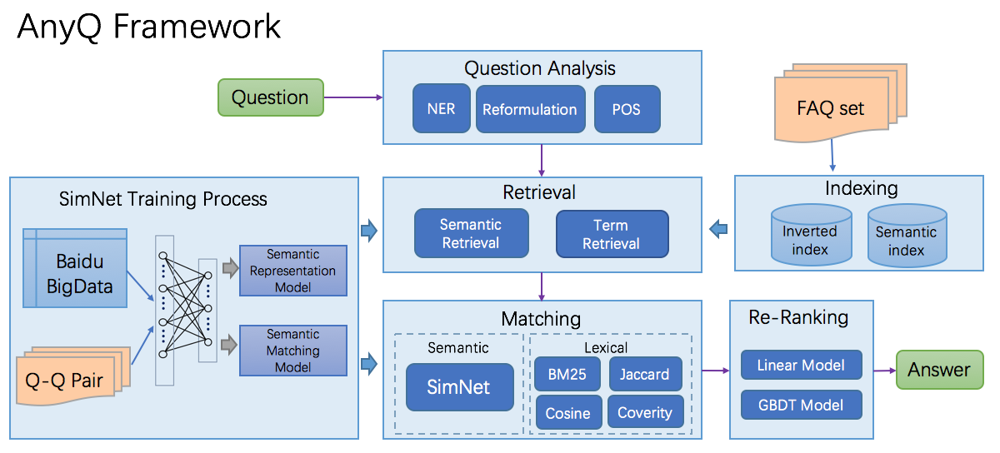

# AnyQ

**AnyQ(ANswer Your Questions)** 开源项目主要包含面向FAQ集合的问答系统框架、文本语义匹配工具SimNet。</br>
<br>问答系统框架采用了配置化、插件化的设计，各功能均通过插件形式加入，当前共开放了20+种插件。开发者可以使用AnyQ系统快速构建和定制适用于特定业务场景的FAQ问答系统，并加速迭代和升级。</br>
<br>SimNet是百度自然语言处理部于2013年自主研发的语义匹配框架，该框架在百度各产品上广泛应用，主要包括BOW、CNN、RNN、MM-DNN等核心网络结构形式，同时基于该框架也集成了学术界主流的语义匹配模型，如MatchPyramid、MV-LSTM、K-NRM等模型。SimNet使用PaddleFluid和Tensorflow实现，可方便实现模型扩展。使用SimNet构建出的模型可以便捷的加入AnyQ系统中，增强AnyQ系统的语义匹配能力</br> ([**English**][10])


## 详细介绍
### **FAQ问答系统框架**

AnyQ系统框架主要由Question Analysis、Retrieval、Matching、Re-Rank等部分组成，框架中包含的功能均通过插件形式加入，如Analysis中的中文切词，Retrieval中的倒排索引、语义索引，Matching中的Jaccard特征、SimNet语义匹配特征，当前共开放了20+种插件。AnyQ系统的配置化、插件化设计有助于开发者快速构建、快速定制适用于特定业务场景的FAQ问答系统，加速迭代和升级。
AnyQ的框架结构如下图：

<center>

</center>

#### 配置化
AnyQ系统集成了检索和匹配的众多插件，通过配置的方式生效；以检索方式和文本匹配相似度计算中的插件为例：

* 检索方式(Retrieval)
    * 倒排索引：基于开源倒排索引Solr，加入百度开源分词
    * 语义检索：基于SimNet语义表示，使用ANNOY进行ANN检索
    * 人工干预：通过提供精准答案，控制输出
* 匹配计算(Matching)
    *  字面匹配相似度：在对中文问题进行切词等处理之后，计算字面匹配特征
        * Cosine相似度
        * Jaccard相似度
        * BM25
    *  语义匹配相似度
        * SimNet语义匹配：使用语义匹配SimNet架构训练的模型，构建问题在语义层面的相似度

#### 插件化

除框架外，AnyQ的所有功能都是通过插件形式加入，用户自定义的插件很容易加到AnyQ系统中，只需实现对应的接口即可，如自定义词典加载、Question分析方法、检索方式、匹配相似度、排序方式等，真正实现可定制和插件化。


### **文本语义匹配框架SimNet**

SimNet是百度自然语言处理部于2013年自主研发的语义匹配框架，该框架在百度各产品上广泛应用，主要包括BOW、CNN、RNN、MM-DNN等核心网络结构形式，同时基于该框架也集成了学术界主流的语义匹配模型，如MatchPyramid、MV-LSTM、K-NRM等模型。SimNet使用PaddleFluid和Tensorflow实现，可方便实现模型扩展。使用SimNet构建出的模型可以便捷的加入AnyQ系统中，增强AnyQ系统的语义匹配能力。

按照文本语义匹配网络结构, 可将SimNet中实现的网络模型主要分为如下两类：

* Representation-based Models </br>
  如：BOW, CNN, RNN(LSTM, GRNN) </br>
  特点：文本匹配任务的两端输入，分别进行表示，之后将表示进行融合计算相似度；
  
* Interaction-based Models </br>
  如：MatchPyramid, MV-LSTM, K-NRM, MM-DNN </br>
  特点：在得到文本word级别的序列表示之后，根据两个序列表示计算相似度匹配矩阵，融合每个位置上的匹配信息给出最终相似度打分；

SimNet使用PaddleFluid和Tensorflow实现，更多文档请参考：

* [SimNet PaddleFluid](https://github.com/baidu/AnyQ/blob/master/tools/simnet/train/paddle/README.md)

* [SimNet TensorFlow](https://github.com/baidu/AnyQ/blob/master/tools/simnet/train/tf/README.md)

#### **基于海量搜索数据的语义模型**

基于百度海量搜索数据，我们训练了一个SimNet-BOW语义匹配模型，在一些真实的FAQ问答场景中，该模型效果比基于字面的相似度方法AUC提升5%以上，模型使用和获取方法参考[Demo](#demo)。


## 代码编译

### Linux
cmake 3.0以上(推荐3.2.2版本)，g++ >=4.8.2，bison >=3.0
```
mkdir build && cd build && cmake .. && make
```
### Others
针对MacOS、Windows等环境，推荐使用docker方式
```
# 使用paddle官方镜像
docker pull paddlepaddle/paddle:latest-dev
```

## Demo

构建索引、配置
```
# 获取anyq定制solr，anyq示例配置
cp ../tools/anyq_deps.sh .
sh anyq_deps.sh

# 启动solr, 依赖python-json, jdk>=1.8
cp ../tools/solr -rp solr_script
sh solr_script/anyq_solr.sh solr_script/sample_docs

```

-  **HTTP-Server**

```
./run_server

# 请求示例：
http:${host}:${port}/anyq?question=XXX

```

- **lib**

```
./demo_anyq sample_input_json
```

## 更多文档

* [AnyQ配置详解](https://github.com/baidu/AnyQ/blob/master/docs/config_tutorial.md)
* [AnyQ如何添加插件](https://github.com/baidu/AnyQ/blob/master/docs/plugin_tutorial.md)
* [AnyQ使用语义索引](https://github.com/baidu/AnyQ/blob/master/docs/semantic_retrieval_tutorial.md)

## 如何贡献
* 可以在AnyQ框架下定制特定功能的插件，教程参考[AnyQ如何添加插件](https://github.com/baidu/AnyQ/blob/master/docs/plugin_tutorial.md)
* 如果觉得自己定制的插件功能足够通用&漂亮，欢迎给我们提交PR


## Copyright and License

AnyQ is provided under the [Apache-2.0 license](https://github.com/baidu/AnyQ/blob/master/LICENSE).

[10]:	README.EN.md

